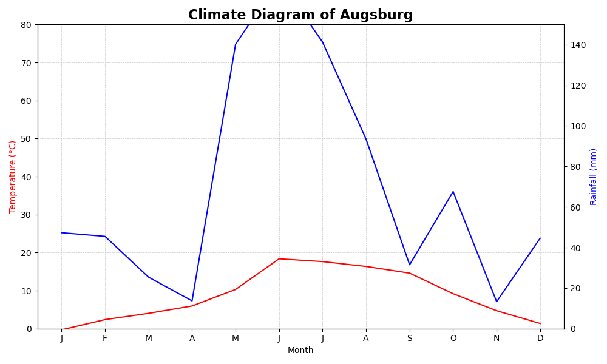
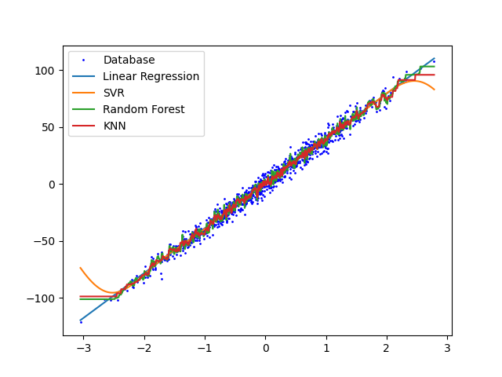
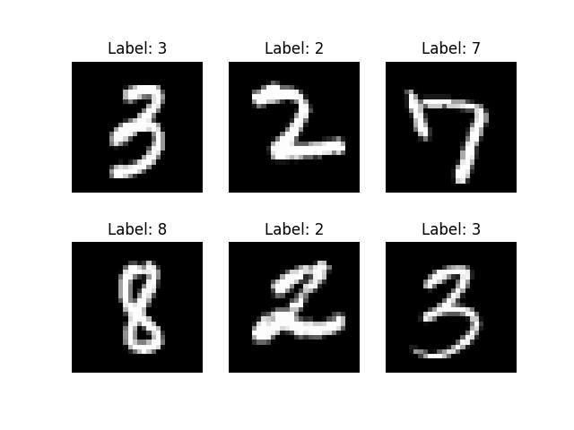
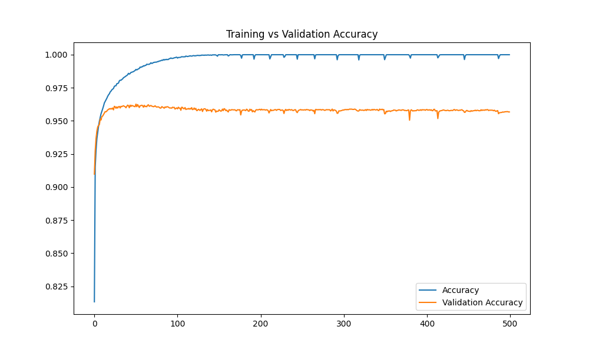
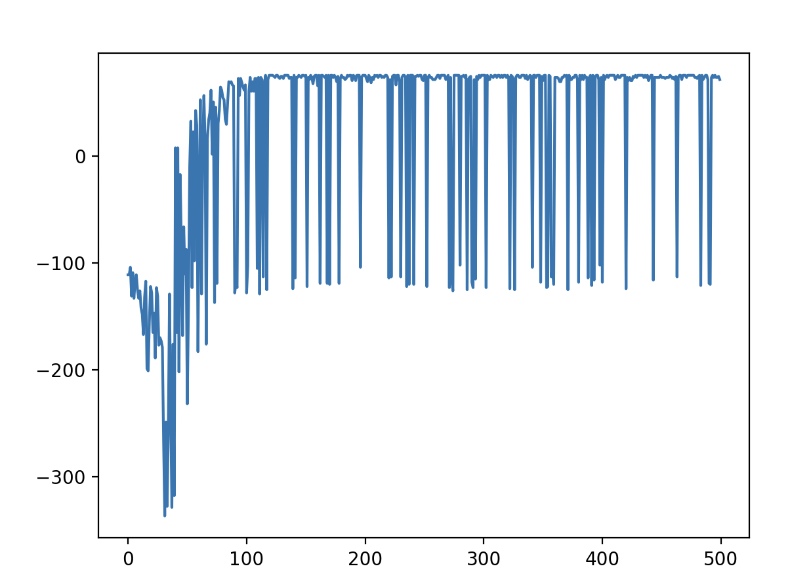
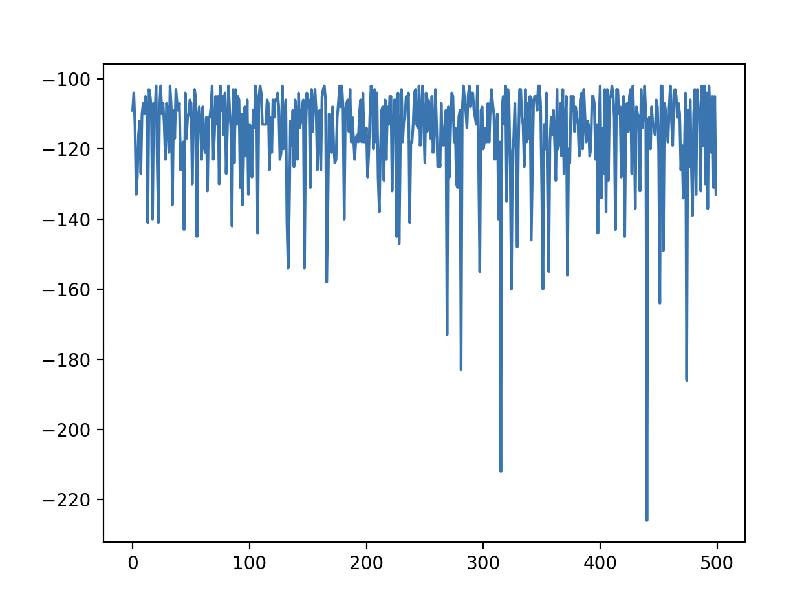
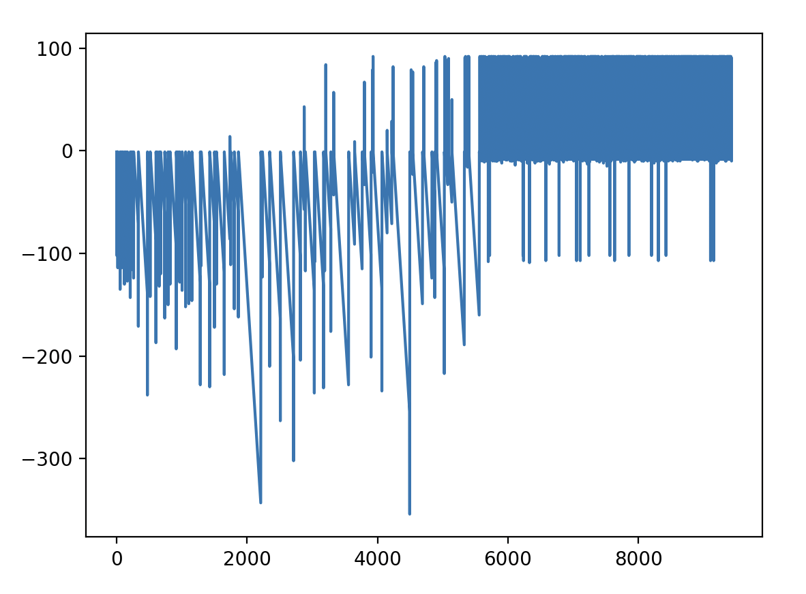
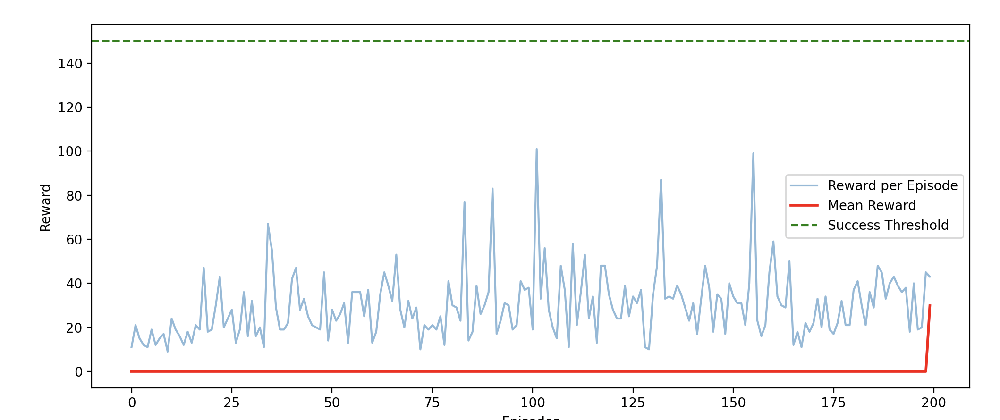
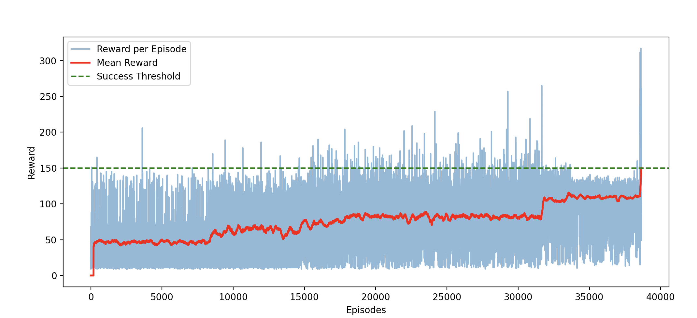
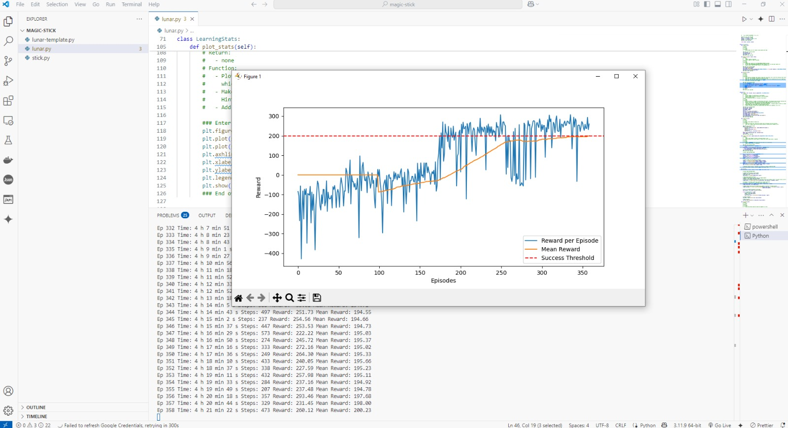

  <h1 align="center">🌟 Applied Data Analytics and Machine Learning in Python 🌟</h1>
  

    A comprehensive journey from Python basics to advanced Reinforcement Learning in OpenAI Gym.
  

  

    
    
    
  

---

## 📚 Table of Contents
- [Block 1 – Introduction to Python](#-block-1--introduction-to-python)
- [Block 2 – Machine Learning in Python](#-block-2--machine-learning-in-python)
- [Block 3 – Introduction to Reinforcement Learning](#-block-3--introduction-to-reinforcement-learning)
- [Block 4 – Reinforcement Learning in OpenAI Gym](#-block-4--reinforcement-learning-in-openai-gym)

---

## 🐍 Block 1 – Introduction to Python
This section covers the fundamental building blocks of Python programming, progressing to data manipulation and visualization projects. 

### ✨ Highlights
- **Climate Diagram Generator**: A custom Python application generating detailed climate diagrams based on weather data.

  
  
<em>Example: Climate Diagram generated for Augsburg.</em>

---

## 🤖 Block 2 – Machine Learning in Python
A deep dive into essential Machine Learning techniques, model training, and evaluation visual analysis.

### ✨ Highlights
Visual analysis of dataset clusters and model performance directly affects training pipelines and parameter adjustments.

  <table>
    <tr>
      <td align="center"> <em>Figure 1: Exploratory Data Visualization</em></td>
      <td align="center"> <em>Figure 2: Data Clustering</em></td>
    </tr>
    <tr>
      <td align="center" colspan="2"> <em>Tracking Model Accuracy & Generalization</em></td>
    </tr>
  </table>

---

## 🧠 Block 3 – Introduction to Reinforcement Learning
Exploring the core concepts of Reinforcement Learning, focusing on the trade-offs between exploration and exploitation using the Q-Learning algorithm.

### ✨ Highlights
Visualizations covering greedy behavior, exploration rates, and Q-Value progression.

  <table>
    <tr>
      <td align="center"> <em>High Exploration (ε = 0.05, less greedy)</em></td>
      <td align="center"> <em>High Exploitation (ε = 0.95, more greedy)</em></td>
    </tr>
  </table>
   
  
  
<em>Performance analysis on reinforcement tasks.</em>

---

## 🎮 Block 4 – Reinforcement Learning in OpenAI Gym
Applying RL agents to interactive environments provided by OpenAI Gym. Tracking episode durations, rewards, and overall convergence over extended training loop runs.

### ✨ Highlights
Comparing training progress across different episode lengths to visualize convergence stability.

  <video src="https://raw.githubusercontent.com/Marinazuzum/Applied-DA-and-ML-in-Python-25/master/04_rl_in_openai_gym/images/rl_training_simulation.mov" width="800" controls muted playsinline>
    
Your browser does not support the video tag. <a href="https://github.com/Marinazuzum/Applied-DA-and-ML-in-Python-25/blob/master/04_rl_in_openai_gym/images/rl_training_simulation.mov">Click here to view the file directly.</a>

  </video>
  
<em>RL Agent live training simulation.</em>

   

  <table>
    <tr>
      <td align="center">
        
         <em>Training after 200 Episodes</em>
      </td>
      <td align="center">
        
         <em>Training after 40,000 Episodes</em>
      </td>
    </tr>
  </table>
   
  
  
  
<em>Extended reward analysis progression graph.</em>

---

  
Made with ❤️ during the Applied Data Analytics and Machine Learning Course.

